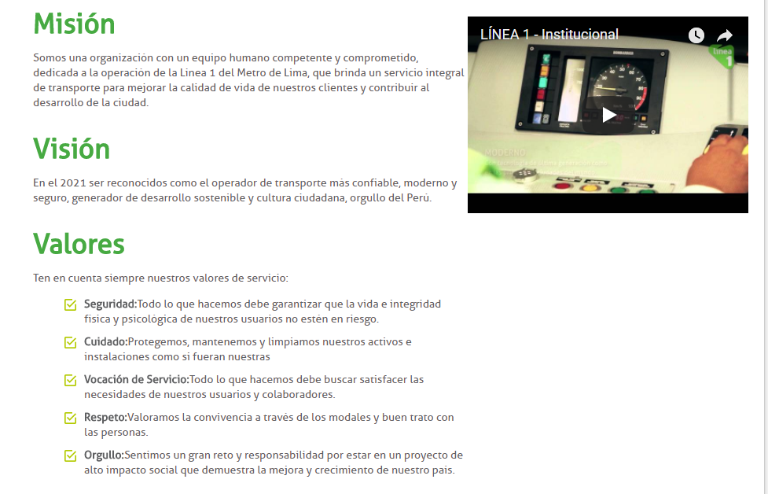
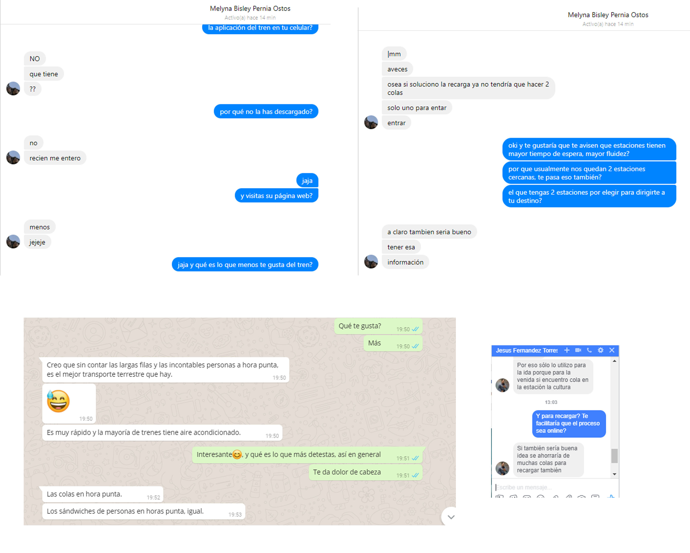
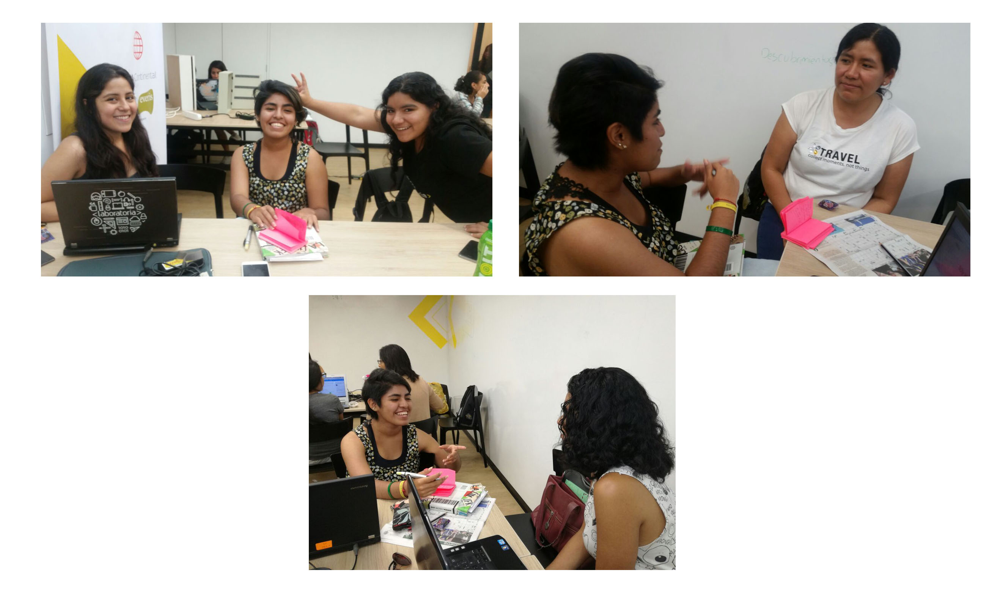
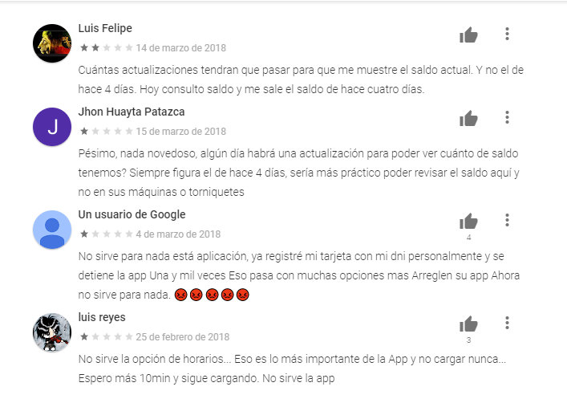
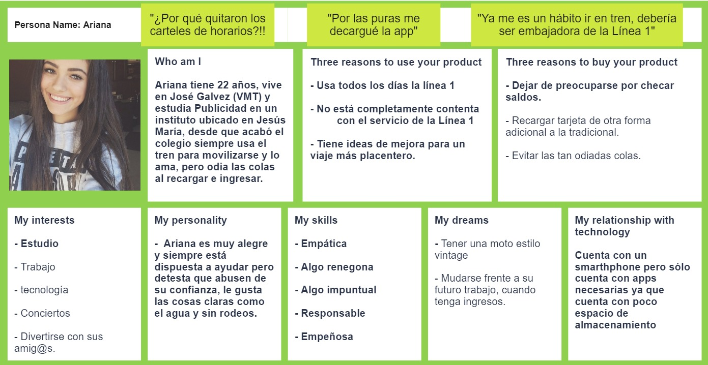
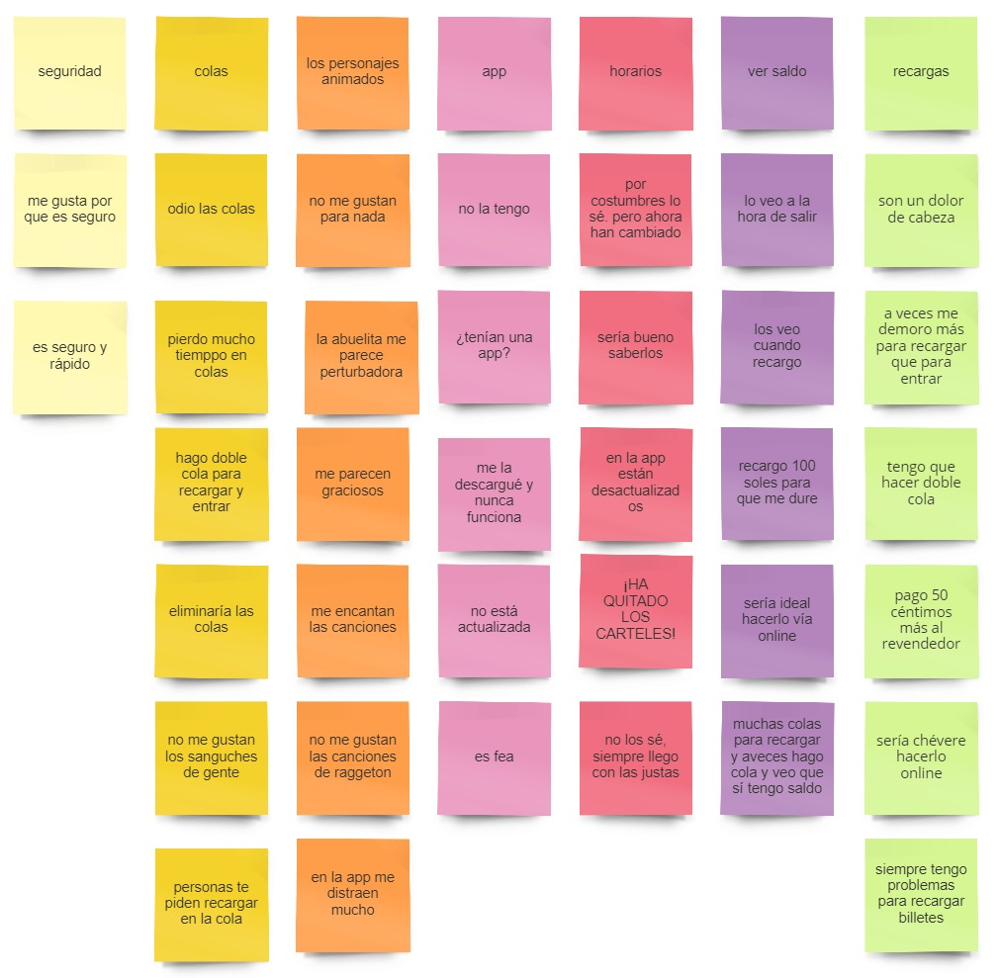
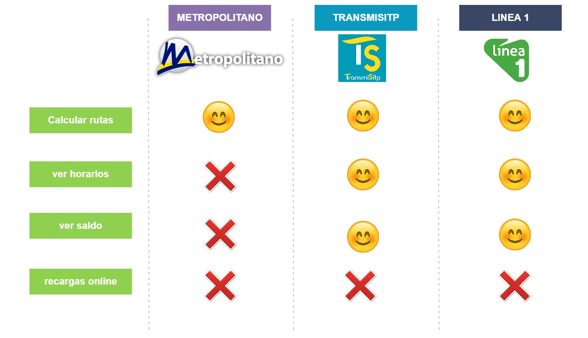
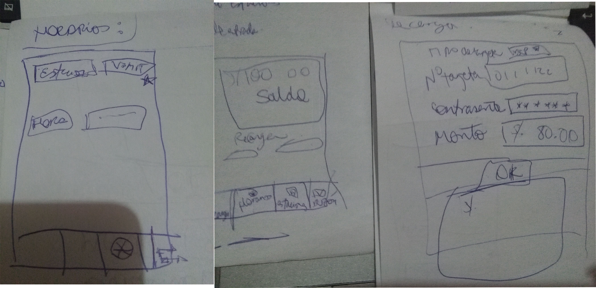
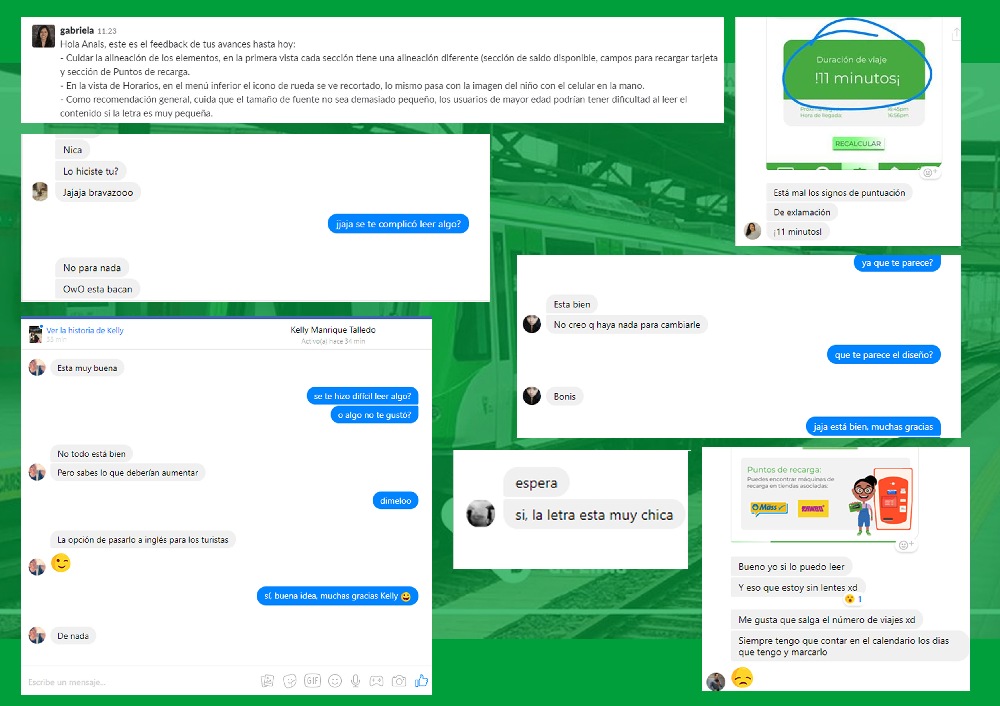
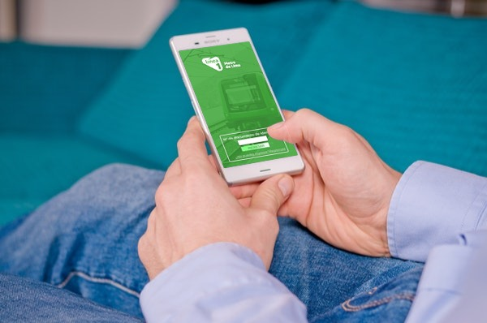

## LÍNEA 1 "El metro de Lima" App
La línea 1 es el primer medio de transporte público que presta servicio de sur a noreste conectando a 11 distritos. Tiene una extensión de 34 km y cuenta con 26 estaciones de las cuales 6 estaciones están a nivel de suelo y 20 en viaducto elevado.

La línea 1 logra transportar aproximadamente 320,000 pasajeros por día. Su recorrido total de estación Villa el salvador a terminal Bayóvar abarcar un tiempo total de 54 minutos con un intervalo de 2 minutos de estación a estación.

Sobre Línea 1:
>

## Presencia Digital
* [Web](http://www.lineauno.pe/)
* [Facebook](https://www.facebook.com/Lineauno.pe/)
* [App](https://play.google.com/store/apps/details?id=com.baellaconsulting.linea1&hl=es_419)

## Objetivo

> Con el resideño de la app de Línea 1 se busca llenar esos vacíos de información que tiene el usuario y de este modo aumentar la sensación de confianza, restar la preocupación y tener una experiencia más reconfortante.

## Proceso de Research
* [Carpeta Drive](https://drive.google.com/drive/folders/1VHImbEPByk5wW5BU0M8YDeLLvrEYEiLG?usp=sharing)
* #### Entrevistas personales:
  En esta etapa se entrevistó de manera presencial y online a usuarios de la Línea 1.

    * María:
      Sólo usó una vez la Línea 1

        Le gustó: No había colas.

        En el caso de María también se realizó una entrevista en base a una competencia secundaria "El metropolitano".

        No le gustó: Desorden, no hay horarios, no hay un mapa que le indique que estación tomar. No tiene ninguna app de estos servicios en su smartphone.

    * Yenny: Usa diariamente la Línea 1.

        Le gusta: Seguro, rápido y cómodo, los personajes animados del tren.

        No le gusta: Lleno, muchas colas, no hay horario de llegada, modalidad de recargas, no puede ver su saldo, algunas canciones de los personajes.

    * Darcy: Usa constantemente la Línea 1.

        Le gusta: El ambiente agradable, la rapidéz.

        No le gusta: Problemas al recargar billetes, a veces se olvida de cuánto saldo tiene.

        Necesita: Recargar vía online, obtener tarjeta vía online,ver saldo.

    * Gabi: Usa diariamente la Línea 1.

        Le gusta: la rapidéz, seguridad.

        No le gusta: Los personajes animados de la Línea 1, no está interesada en los eventos.

        Necesita: Recargar tarjeta a modo BCP, ver saldos, recargar, ver fecha de vencimiento, a través de la app.

    * Melyna: Usa diariamente la Línea 1.

        Le gusta: la rapidéz, que tenga aire acondicionado.

        No le gusta: Odia las colas

        Necesita: Recargar tarjeta a modo BCP, ver saldos, recargar, ver fecha de vencimiento, a través de la app.

* #### Comentarios de usuarios de app:
>

* #### User persona:
>

* #### Affinity map:
>

* #### Benchmark:
>

## Prototipado
* #### Prototipado y bocetaje en papel:
  Se realizaron iteraciones de los flujos principales para validar y descartar algunas funciones de la aplicación.
  >

* #### 1° Prototipado de alta fidelidad:
  En base a un primer feedback se realizó una primera versión de la app de la Línea 1.
  * [Figma](https://www.figma.com/file/XFGbyH2WeNDxuxQMGaMJjX6n/LINE-1)
  * [Marvel](https://marvelapp.com/3b224eh/screen/40073917)

## Testing
  * Se obtuvo las siguientes respuestas de un testing online con 5 personas que son parte del target.

  Como puntos principales se mejoraron:

    * Tamaño de fuente
    * Alineación
    * Falla ortográfica

  

* #### 2° Prototipado de alta fidelidad:
  * [Figma](https://www.figma.com/file/Es1ceGtwZzI1yWbegtLqVD/LINE-1-Copy)
  * [Marvel](https://marvelapp.com/64944h1/screen/40080783)

  
